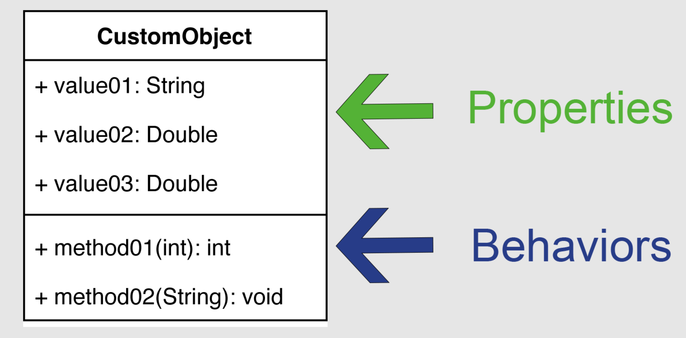
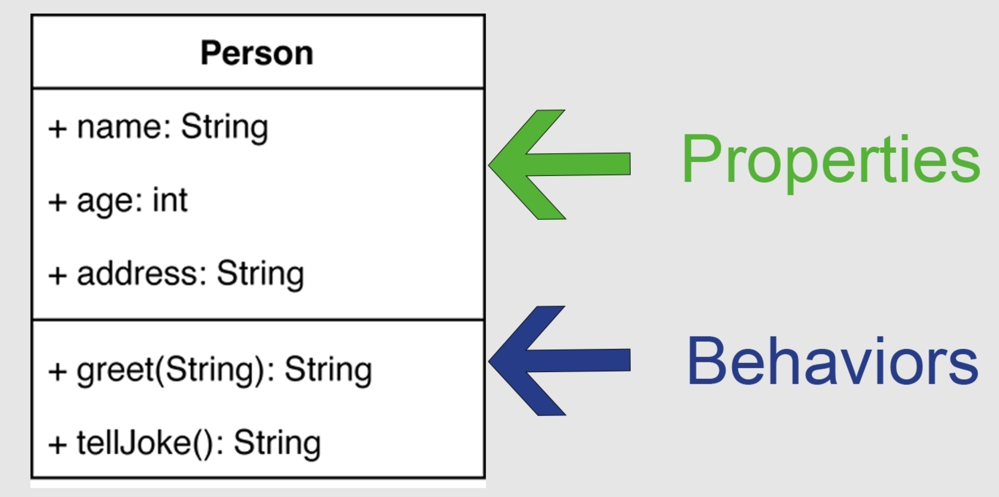
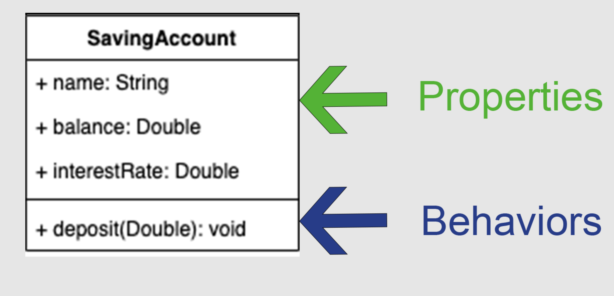
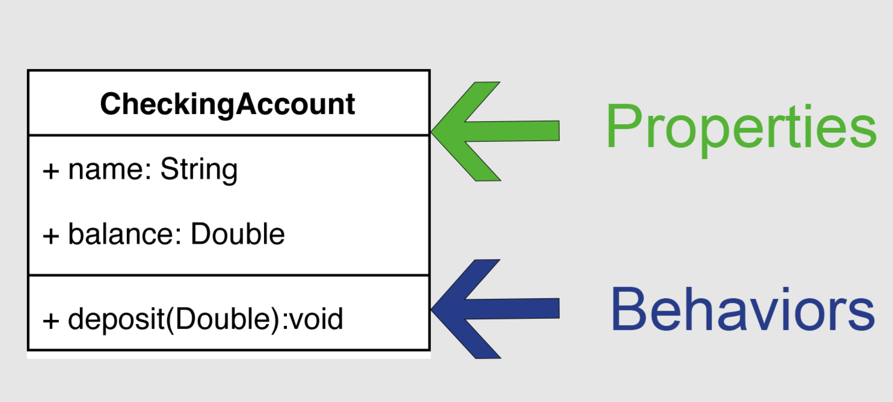
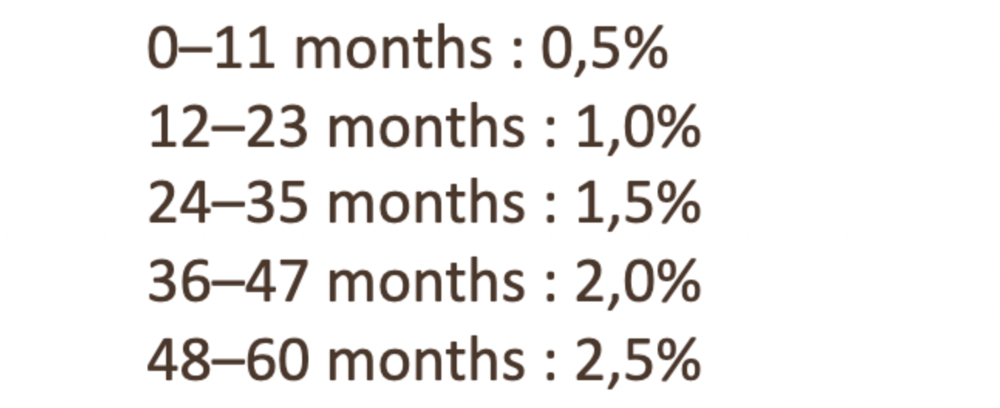

# Return Ready Lab 16

* Part A - Foundations 7.1

## Part A

>Exercise 01 in the lecture slides requires we have Java FX installed, so we will not be doing that activity.

>JavaFx is not used a lot, and is slowly falling to the wayside. It's not even included in every version of the Java Development Kit. We installed a version of the JDK that does not include FX.

### UML

**The Unified Modeling Language (UML)** is a general-purpose, developmental, modeling language in the field of software engineering that is intended to provide a standard way to visualize the design of a system.

**Classes**: A template for creating objects and implementing behavior in a system. In UML, a class represents an object or a set of objects that share a common structure and behavior. They're represented by a rectangle that includes rows of the class name, its **properties** (attributes), and its **behaviors** (operations).

* **Properties** - are the values your object will store.
* **Behaviors** - are the actions your object can perform.

### Example 01 Person

The person class contains properties and behaviors:

* Properties ( Things the object stores )
    * name
    * age
    * address
* Behaviors (Things the object can do )
    * greet
    * tellJoke

Take a look at the `Person` class in `partA.example01`

1. Comment each line of code, and review with class.
2. Run `PersonTest` and see if what you expected to happen matches up.

### Exercise 01

Below is the UML for the `SavingAccountExample` class in the `partA.ex01` package.

1. Write comments for each line in `SavingAccountExample` and review with class.
2. In the `partA.ex01` package finish the `CheckingAccount` class based on the UML below

3. Complete `CheckingAccountTest` look at `SavingAccountTest` for inspiration.

### Exercise 02

* In the `partA.ex02` package complete `SavingBond` with the following requirements.
    * A person may purchase a bond for any term between 1 and 60 months
    * A bond earns interest every month until its term matures (0 months remaining)
    * The term and interest rate are set at the same time
    * The bond's interest rate is based on its term according to the following tier system.

	